# edSmith

Multi-agent generative feedback system for IELTS writing assessment. An Examiner agent generates per-component Feedback each iteration; a lightweight Scorer (Qwen3 + LoRA) is fine-tuned on that Feedback; a Chief Examiner agent diagnoses quality and proposes updated Prompt Policies and Strategy Guidance for the next iteration. Claude Code orchestrates the loop.

## Quick start

**1. Install**

```bash
uv sync
```

**2. Set environment variables**

```bash
export OPENROUTER_API_KEY="sk-or-..."
export EDSMITH_DRIVE_PATH="/path/to/edsmith"   # local mirror of Google Drive folder
```

**3. Generate a default config**

```bash
edsmith init-config session.yaml
```

**4. Connect the MCP server**

Add the edSmith server to `.claude/settings.local.json` (gitignored):

```json
{
  "mcpServers": {
    "edsmith": {
      "command": "uv",
      "args": ["--directory", "/path/to/edSmith", "run", "-m", "edsmith.mcp"]
    }
  }
}
```

Verify the connection with `/mcp` inside a Claude Code session.

**5. Connect a Colab GPU runtime**

Open `notebooks/edsmith_training.ipynb` in a Colab session with a GPU runtime. The notebook is driven via [`SebastianGilPinzon/colab-mcp`](https://github.com/SebastianGilPinzon/colab-mcp) — a community fork that fixes tool visibility and GPU control issues in the official client. Add it to `.claude/settings.json`:

```json
{
  "mcpServers": {
    "colab-proxy-mcp": {
      "type": "stdio",
      "command": "uvx",
      "args": ["git+https://github.com/SebastianGilPinzon/colab-mcp"]
    }
  }
}
```

Make sure Google Drive is mounted in Colab and that `EDSMITH_DRIVE_PATH` points to the same folder in both environments.

**6. Start a session**

Ask Claude Code to start a session. It will follow the guide in `agents/edsmith.md` and call MCP tools in sequence:

```
init_session → run_examiner_pass → [Colab: train → evaluate] → run_chief_examiner → human review → approve_proposal → (next iteration)
```

---

## Architecture

Two environments share a single Google Drive path. Claude Code is the session orchestrator — it calls MCP tools in sequence, handles the human review gate, and drives Colab cells via `run_cell`. All state lives on disk; every step is independently resumable.

```mermaid
flowchart TD
    CC(["Claude Code"])

    subgraph Local["Local Machine"]
        Init["init_session"]
        Exam["run_examiner_pass"]
        Chief["run_chief_examiner"]
        Approve["approve_proposal"]
        Reject["reject_proposal"]
    end

    subgraph Colab["Colab GPU"]
        Train["Train Scorer"]
        Eval["Evaluate Scorer"]
    end

    Drive[("EDSMITH_DRIVE_PATH")]

    CC -->|MCP| Local
    CC -->|run_cell| Colab
    Local <-.-> Drive
    Colab <-.-> Drive

    Init --> Exam
    Exam --> Train
    Train --> Eval
    Eval --> Chief
    Chief --> HR{Human Review}
    HR -->|approve| Approve
    HR -->|reject| Reject
    Approve -->|next iter| Exam
    Reject --> Chief
```



**Drive file operations** (`sessions/{session_id}/`):

| File | Written by | Read by |
|---|---|---|
| `state.json` | `init_session`, `approve_proposal` | `run_examiner_pass`, `run_chief_examiner` |
| `data/*.parquet` | `run_examiner_pass` (first call only) | Train, Eval |
| `feedback_iter{N}.parquet` | `run_examiner_pass` | Train |
| `models/iter{N}/` | Train | Eval |
| `metrics_iter{N}.json` | Eval | `run_chief_examiner` |
| `proposals/iter{N}.json` | `run_chief_examiner`, `approve_proposal`, `reject_proposal` | `run_chief_examiner` (history) |

---

## CLI

```bash
edsmith init-config [output]                      # write a default session.yaml
edsmith start-server [--port PORT]                # start the edSmith MCP server
edsmith show-sessions [--drive PATH]              # list sessions, iterations, pending proposals
edsmith examiner-pass <session_id> <iteration>    # batch feedback generation (long-running)
```

Run tests (no API key needed):

```bash
pytest
pytest tests/examiner/               # one domain directory
```

---

## Config reference

All options live in `session.yaml`. Runtime state (Prompt Policies, Strategy Guidance, iteration counter) lives in `SessionState` on disk — managed by the MCP tools, not this file.

### `sampling`

```yaml
sampling:
  size: 500             # cap on the training pool; null = full dataset
  validation_ratio: 0.15
  test_ratio: 0.15      # fraction of HF test split to use; null = all
  random_state: 42
```

With `size: 500` and both ratios at `0.15`:
- `train` ≈ 425 rows — Examiner generates Feedback, Scorer trains on this
- `val` ≈ 75 rows — evaluated each iteration, metrics drive Chief Examiner
- `test` ≈ 75 rows — evaluated each iteration, only aggregated metrics reach the Chief Examiner

### `scorer`

```yaml
scorer:
  model_name: unsloth/Qwen3-1.7B
  component: task_response   # one component per session, or null = all four
  max_steps: 40
  lora_r: 16
  lora_alpha: 16
  learning_rate: 0.0002
  per_device_train_batch_size: 2
  gradient_accumulation_steps: 4
  max_seq_length: 512
  load_in_4bit: true
```

When `component` is set, training and evaluation are restricted to that component's rows. Run separate sessions to train all four.

### `models`

```yaml
models:
  generator: mistralai/mistral-7b-instruct   # Examiner feedback generation
  critic: mistralai/mistral-7b-instruct      # reserved
  chair: anthropic/claude-sonnet-4-5         # Chief Examiner diagnostic
```

### `prompt_policies`

One entry per IELTS component. Initial values come from this file; the Chief Examiner proposes updates to these each iteration via `run_chief_examiner` / `approve_proposal`.

```yaml
prompt_policies:
  task_response:
    specificity: 2              # 1 (brief) → 5 (comprehensive)
    evidence_required: true
    feedback_granularity: component   # component | overall | both
    additional_instructions: ""
  coherence:    { ... }
  lexical:      { ... }
  grammar:      { ... }
```

Strategy Guidance (which linguistic tools to inject, contrastive anchoring, per-component focus) is managed by the Chief Examiner at runtime and is not part of `session.yaml`.

---

## Local development

The MCP server runs directly from the repo via `uv`, so source changes are reflected immediately — no reinstall step.

`.claude/settings.local.json` (gitignored) should point `--directory` at the repo root. Environment variables (`OPENROUTER_API_KEY`, `EDSMITH_DRIVE_PATH`) are loaded from `.env` in the repo root by `load_dotenv()` at startup.
